# Human-in-the-Loop Presentation Creation — Technical Description

## Overview

A refactored presentation generation system where **every phase requires human verification** before proceeding. The pipeline transforms from a fire-and-forget linear flow into an interactive, revision-capable state machine. Each slide has its own lifecycle, version history, and approval status.

**Core principles:**
- Human reviews and approves each phase before moving forward
- Per-slide granularity for revision (not full-phase regeneration)
- Versioned artifacts — every revision is saved
- Partial approval — approve some slides, revise others
- Marimo Notebook as the interactive UI

---

## Architecture

```mermaid
graph TB
    subgraph "Input Layer"
        UI[Marimo Notebook]
        API[REST API]
    end

    subgraph "Orchestration Layer"
        SM[Phase State Machine]
        VM[Version Manager]
        AM[Artifact Manager]
    end

    subgraph "Agent Layer"
        PA[Planner Agent]
        RA[Research Agent]
        DA[Design Agent]
        EA[Export Agent]
    end

    subgraph "Tool Layer"
        TY[Yandex Search]
        TR[Research Tools]
        TA[Any2Markdown]
        TD[Inspect Tools]
    end

    subgraph "Storage Layer"
        WS[Workspace /slides/{slide_id}/]
        V1[v1/ artifacts]
        V2[v2/ artifacts]
        VN[vN/ artifacts]
        MD[metadata.json]
    end

    UI --> SM
    API --> SM
    SM --> PA
    SM --> RA
    SM --> DA
    SM --> EA
    PA --> TY
    PA --> TR
    RA --> TY
    RA --> TR
    RA --> TA
    DA --> TD
    PA --> VM
    RA --> VM
    DA --> VM
    EA --> VM
    VM --> WS
    WS --> V1
    WS --> V2
    WS --> VN
    WS --> MD
```

---

## Agents

The system uses the following agents:

| Agent | Purpose | Model Config |
|-------|---------|--------------|
| **Planner** | Generates outline (JSON: index, title, context per slide) | `research_agent` |
| **Research** | Generates manuscript (Markdown, `---` separated slides) | `research_agent` |
| **Design** | Generates HTML slides (slide_01.html, slide_02.html, ...) | `design_agent` |
| **PPTAgent** | Legacy template-based PPTX generation (not used in HITL) | `research_agent` |
| **SubAgent** | Delegated subtasks with isolated workspace (not used in HITL) | `design_agent` |

**HITL uses:** Planner, Research, Design. PPTAgent and SubAgent are legacy/multiagent features not needed for HITL.

---

## Pipeline State Machine

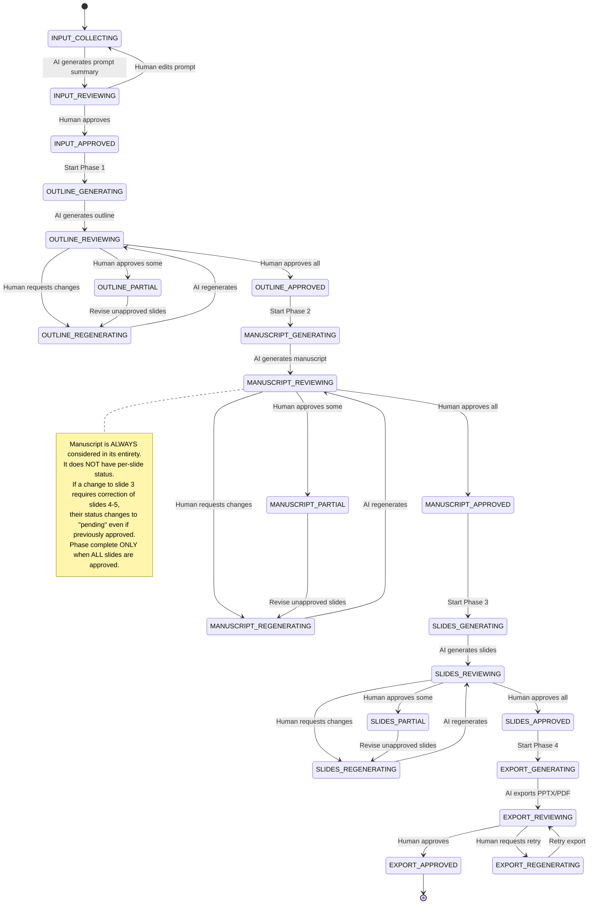

---

## Per-Slide Lifecycle

Each slide has an independent lifecycle within each phase:

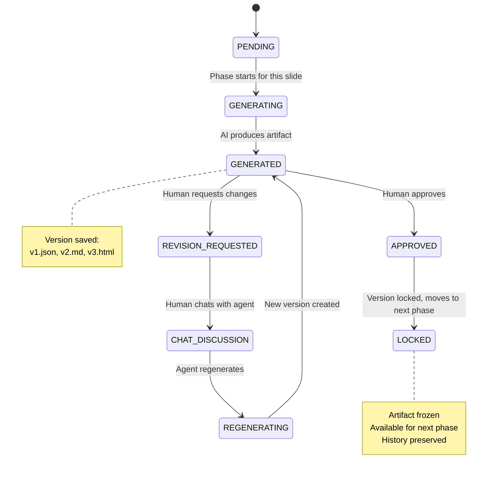

### Slide Status: Active vs Removed

Slides are never deleted — they are marked as **Removed** when the human wants to exclude them:

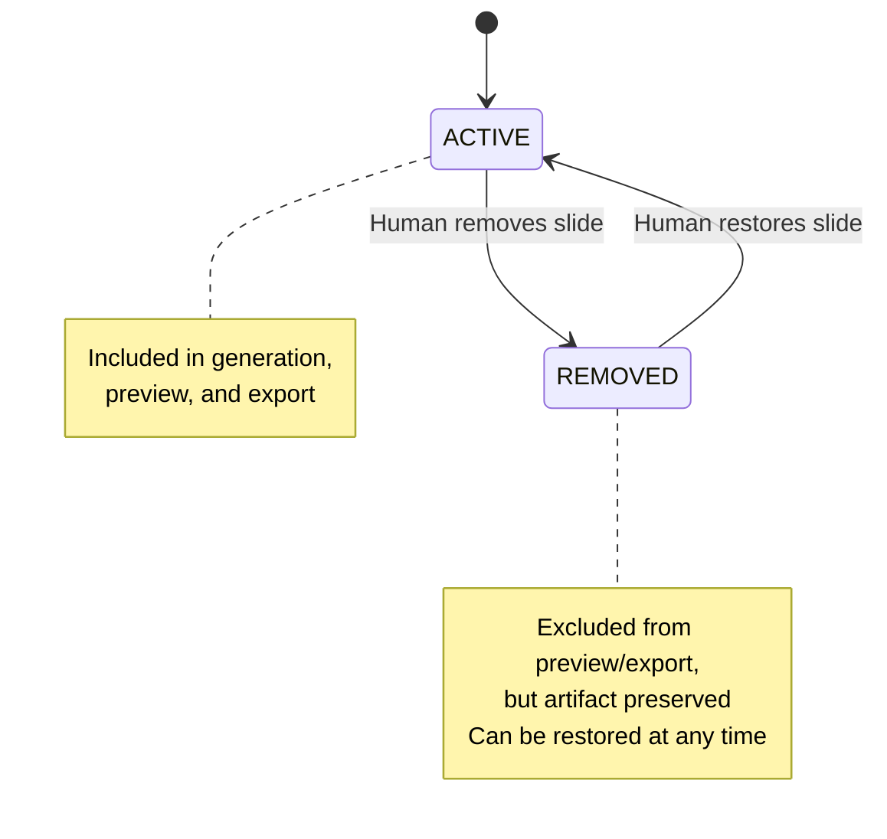

**Status semantics:**
- **Active** — Slide is included in phase generation, preview, and export
- **Removed** — Slide is excluded from preview/export but all artifacts are preserved. Can be restored at any time.

**Why not delete?**
- Preserves full history — no accidental data loss
- Allows restoration — human can change their mind
- Maintains slide numbering stability — `slide_03` stays `slide_03` even if removed
- Enables comparison — can see what was removed and why

---

## Workspace Structure

```
workspace/
├── metadata.json                    # Global pipeline state
├── input/
│   └── v1/
│       └── request.json             # Original input
├── outline/
│   ├── metadata.json                # Per-slide status
│   └── slides/
│       ├── slide_01/
│       │   ├── v1/
│       │   │   └── outline.json
│       │   ├── v2/                  # If revised
│       │   │   └── outline.json
│       │   └── current.json         # Symlink to latest approved
│       ├── slide_02/
│       │   ├── v1/
│       │   │   └── outline.json
│       │   └── current.json
│       └── ...
├── manuscript/
│   ├── metadata.json
│   └── slides/
│       ├── slide_01/
│       │   ├── v1/
│       │   │   └── content.md
│       │   ├── v2/
│       │   │   └── content.md
│       │   └── current.md
│       └── ...
├── slides/
│   ├── metadata.json
│   ├── design_plan.md               # Global design plan
│   └── slide_01/
│       ├── v1/
│       │   ├── slide.html
│       │   └── assets/
│       ├── v2/
│       │   ├── slide.html
│       │   └── assets/
│       └── current.html
├── export/
│   ├── metadata.json
│   ├── v1/
│   │   ├── presentation.pptx
│   │   └── presentation.pdf
│   └── current/
│       ├── presentation.pptx
│       └── presentation.pdf
└── chat/
    └── slide_01/
        └── history.jsonl            # Chat history per slide
```

---

## Metadata Schema

### Global Metadata (`metadata.json`)

```json
{
  "pipeline_id": "uuid",
  "created_at": "2026-05-01T00:00:00Z",
  "updated_at": "2026-05-01T00:00:00Z",
  "total_slides": 12,
  "active_slides": 10,
  "removed_slides": 2,
  "phases": {
    "input": { "status": "approved", "current_version": 1 },
    "outline": { "status": "approved", "current_version": 2 },
    "manuscript": { "status": "partial", "current_version": 1,
                    "approved": [1,2,3,4,5], "pending": [6,7,8,9,10] },
    "slides": { "status": "generating", "current_version": 0 },
    "export": { "status": "pending", "current_version": 0 }
  },
  "slides": {
    "slide_01": {
      "status": "active",
      "outline": { "status": "approved", "version": 2 },
      "manuscript": { "status": "approved", "version": 1 },
      "slides": { "status": "approved", "version": 1 }
    },
    "slide_02": {
      "status": "active",
      "outline": { "status": "approved", "version": 1 },
      "manuscript": { "status": "revision_requested", "version": 1 },
      "slides": { "status": "pending", "version": 0 }
    },
    "slide_03": {
      "status": "removed",
      "removed_at": "2026-05-01T12:30:00Z",
      "outline": { "status": "approved", "version": 1 },
      "manuscript": { "status": "approved", "version": 1 },
      "slides": { "status": "pending", "version": 0 }
    }
  }
}
```

### Per-Slide Metadata

```json
{
  "slide_id": "slide_01",
  "title": "Q4 Revenue Overview",
  "status": "active",
  "created_at": "2026-05-01T00:00:00Z",
  "removed_at": null,
  "versions": {
    "outline": {
      "total_versions": 2,
      "approved_version": 2,
      "versions": {
        "1": { "created_at": "...", "feedback": "Too vague, add specifics" },
        "2": { "created_at": "...", "feedback": null, "approved": true }
      }
    },
    "manuscript": {
      "total_versions": 1,
      "approved_version": 1,
      "versions": {
        "1": { "created_at": "...", "feedback": null, "approved": true }
      }
    },
    "slides": {
      "total_versions": 3,
      "approved_version": 3,
      "versions": {
        "1": { "created_at": "...", "feedback": "Text overlaps image" },
        "2": { "created_at": "...", "feedback": "Font too small" },
        "3": { "created_at": "...", "feedback": null, "approved": true }
      }
    }
  }
}
```

---

## Marimo Notebook Layout

```
┌─────────────────────────────────────────────────────────────────────┐
│  📊 Presentation Creator                                            │
│                                                                     │
│  ┌───────────────────────────────────────────────────────────────┐ │
│  │  Global Controls                                              │ │
│  │                                                               │ │
│  │  Phase: [Outline ▼]  Model: [Claude Sonnet 4.5 ▼]           │ │
│  │  Slides: 10 active / 2 removed / 12 total                   │ │
│  │  Status: ✅ All phases complete                              │ │
│  │                                                              │ │
│  │  Per-Phase Models:                                          │ │
│  │  Outline: [Claude Sonnet 4.5 ▼]  Manuscript: [GPT-4o ▼]   │ │
│  │  Slides: [Gemini Pro ▼]         Export: [Auto ▼]           │ │
│  └───────────────────────────────────────────────────────────────┘ │
│                                                                     │
│  ┌─ Slide 01 ──────────────────────────────────────────────────┐  │
│  │  🟢 Outline v2    🟢 Manuscript v1    🟡 Slides v3         │  │
│  │  Status: 🟢 Active    [🗑️ Remove]                           │  │
│  │                                                               │ │
│  │  Title: Q4 Revenue Overview                                  │ │
│  │                                                               │ │
│  │  [📝 Outline] [📄 Manuscript] [🎨 Slides] [💬 Chat]         │ │
│  │                                                               │ │
│  │  ┌───────────────────────────────────────────────────────┐   │ │
│  │  │  Current Artifact Preview                           │   │ │
│  │  │  (Markdown/HTML rendered)                           │   │ │
│  │  └───────────────────────────────────────────────────────┘   │ │
│  │                                                               │ │
│  │  [✅ Approve]  [✏️ Request Changes]  [💬 Chat with Agent]  │ │
│  │                                                               │ │
│  │  Chat: "Make the revenue section more concise"              │ │
│  │  Agent: "Updated. Here's the revised version..."            │ │
│  └─────────────────────────────────────────────────────────────┘  │
│                                                                     │
│  ┌─ Slide 03 (Removed) ────────────────────────────────────────┐  │
│  │  🟢 Outline v1    🟢 Manuscript v1    ⚪ Slides pending    │  │
│  │  Status: 🔴 Removed    [♻️ Restore]                         │  │
│  │  Removed at: 2026-05-01 12:30                              │ │
│  │  (Artifacts preserved — can be restored at any time)        │ │
│  └─────────────────────────────────────────────────────────────┘  │
│                                                                     │
│  [➕ Add Slide]  [📥 Import]  [📤 Export PPTX]  [💾 Save]         │
│  [👁️ Show Removed]  [🔢 Reorder Slides]                          │
└─────────────────────────────────────────────────────────────────────┘
```

### Marimo Reactive Architecture

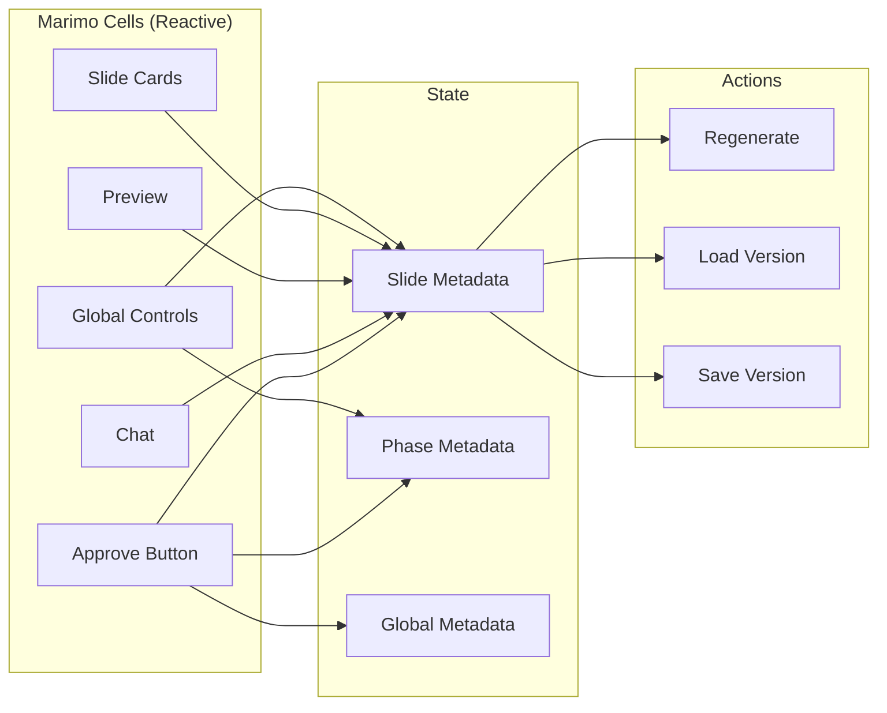

---

## Phase Details

### Phase 0: Input Collection

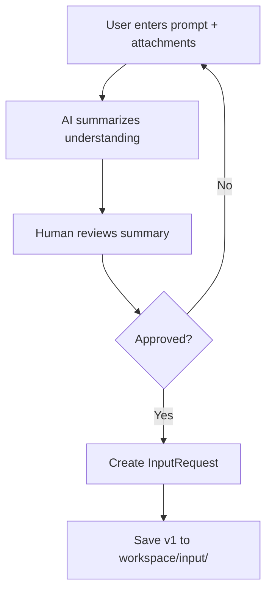

**Artifacts:**
- `input/v1/request.json` — Original user input
- `input/v1/summary.md` — AI's understanding of the task

**Human controls:**
- Edit prompt
- Add/remove attachments
- Set slide count, aspect ratio, language
- Toggle planner on/off

---

### Phase 1: Outline

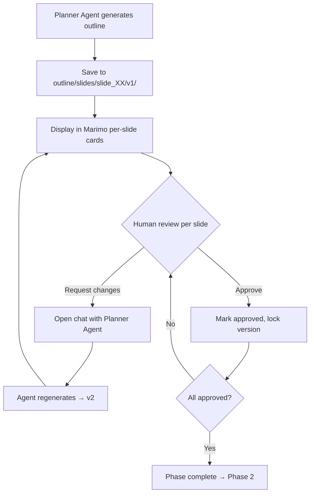

**Artifacts per slide:**
- `outline/slides/slide_XX/v1/outline.json`
  ```json
  {
    "index": 1,
    "title": "Q4 Revenue Overview",
    "context": "Key metrics showing 23% YoY growth..."
  }
  ```

**Human controls per slide:**
- Approve / Request Changes
- Edit title and context manually
- Chat with Planner Agent: "Make this more specific about SaaS revenue"
- View version history

---

### Phase 2: Manuscript

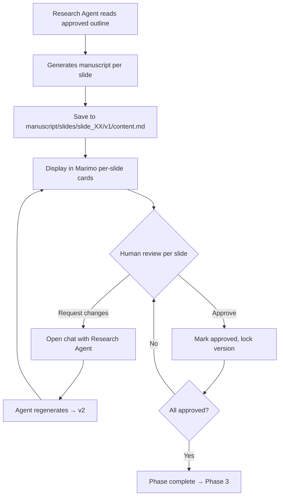

**Artifacts per slide:**
- `manuscript/slides/slide_XX/v1/content.md`
- `manuscript/slides/slide_XX/v1/images/` — Downloaded/generated images

**Manuscript Rules:**
- The manuscript is **always considered in its entirety** — not per-slide
- The manuscript does NOT have its own approval status
- If a change to slide 3 requires correction of slides 4-5, their status changes to "pending"
- Phase complete ONLY when ALL slides are approved
- Changes propagate: if the LLM notices that modifying slide 3 affects slide 4, it marks slide 4 as "pending"

**Human controls per slide:**
- Approve / Request Changes
- Edit markdown directly
- Chat with Research Agent: "Add more data about enterprise segment"
- View version history
- Preview with images

---

### Phase 3: Slides (Design)

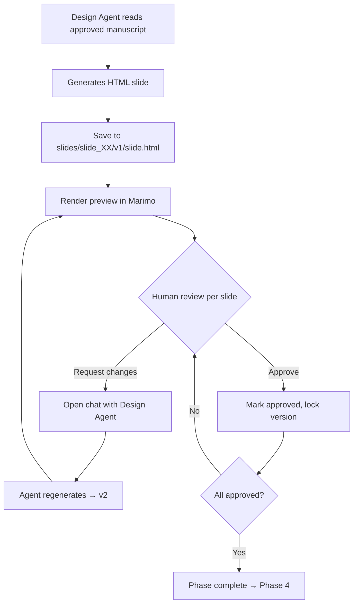

**Artifacts per slide:**
- `slides/slide_XX/v1/slide.html`
- `slides/slide_XX/v1/assets/` — Slide-specific assets
- `slides/design_plan.md` — Global design plan (once per phase)

**Human controls per slide:**
- Approve / Request Changes
- Edit HTML/CSS directly
- Chat with Design Agent: "Move the chart to the right, make text larger"
- View version history
- Live preview

---

### Phase 4: Export

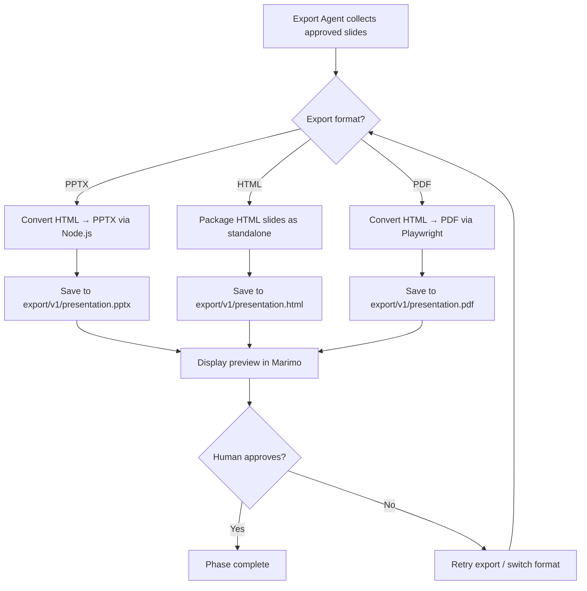

**Artifacts:**
- `export/v1/presentation.pptx` — Editable text PPTX (not just images)
- `export/v1/presentation.html` — Standalone HTML presentation
- `export/v1/presentation.pdf` — PDF fallback
- `export/v1/preview/` — Per-slide preview images

**Export Formats:**

| Format | Description | Use Case |
|--------|-------------|----------|
| **PPTX** | Editable text, images, layout (pptxgenjs) | Final delivery, editing in PowerPoint |
| **HTML** | Standalone HTML slides with CSS | Web viewing, no PowerPoint needed |
| **PDF** | Fixed layout via Playwright | Printing, sharing where editing not needed |

**PPTX Structure:**
- Editable text (not rendered as images)
- Preserves fonts, colors, layout from HTML
- Uses pptxgenjs for conversion
- Design plan (design_plan.md) informs theme/master slide

**Human controls:**
- Approve / Retry
- Switch format (PPTX ↔ HTML ↔ PDF)
- Download final output

---

## Chat Interface Design

Each slide has an embedded chat with the relevant agent, but **under the hood there is one unified chat** with the LLM. The per-slide chats in Marimo are a convenient representation of discussion parts about specific slides.

### Unified Chat Architecture

```
                    ┌─────────────────────────────────────────┐
                    │          General Chat (Marimo)          │
                    │                                         │
                    │  Full dialogue with LLM, all messages   │
                    │  tagged with slide number when relevant │
                    │                                         │
                    │  [Slide 1] Make title more specific     │
                    │  [Slide 1] Updated. New title: "Q4..."  │
                    │  [Slide 3] Add revenue data             │
                    │  [Slide 3] Done. Added $4.2M figure     │
                    │  [Slide 4] This affects slide 4 too     │
                    │  [Slide 4] Corrected. Marked pending.   │
                    └─────────────────────────────────────────┘
                              │
              ┌───────────────┼───────────────┐
              ▼               ▼               ▼
        ┌──────────┐   ┌──────────┐   ┌──────────┐
        │Slide 1   │   │Slide 3   │   │Slide 4   │
        │Chat      │   │Chat      │   │Chat      │
        │          │   │          │   │          │
        │[Slide 1] │   │[Slide 3] │   │[Slide 4] │
        │Make      │   │Add       │   │Corrected │
        │title...  │   │revenue...│   │Marked    │
        │          │   │          │   │pending   │
        └──────────┘   └──────────┘   └──────────┘
```

### How It Works

1. **User writes in slide-specific chat** (e.g., slide 3):
   - Message is added to the **general chat** with tag `[Slide 3]`
   - LLM response is also added to general chat with `[Slide 3]` tag
   - Both are displayed in the slide 3 section (without the slide number tag)

2. **LLM references other slides**:
   - If LLM notices that a change to slide 3 affects slide 4
   - Comment about slide 4 is recorded in **both** the general chat AND slide 4's chat section
   - Slide 4's status changes to "pending" if it was previously approved

3. **General chat section in Marimo**:
   - Shows the full dialogue with all slide tags
   - User can see the complete conversation context
   - User can write directly to general chat (without slide tag = global message)

```
┌─ Slide 01 — Chat ─────────────────────────────────────────────────┐
│                                                                    │
│  Agent: Planner Agent    Model: Claude Sonnet 4.5                 │
│                                                                    │
│  ┌────────────────────────────────────────────────────────────┐   │
│  │  User:  Make the title more specific                       │   │
│  │  Agent: Updated. New title: "Q4 2025 SaaS Revenue: $4.2M" │   │
│  │  User:  Add context about enterprise vs SMB split          │   │
│  │  Agent: Done. Context now includes the breakdown.          │   │
│  │  Agent: Note: This change may affect slide 03's revenue    │   │
│  │          chart. Should I update it?                        │   │
│  └────────────────────────────────────────────────────────────┘   │
│                                                                    │
│  [Type message...]                              [Send]             │
│                                                                    │
│  [🔄 Regenerate]  [📋 Copy]  [↩️ Undo]                            │
└────────────────────────────────────────────────────────────────────┘

┌─ General Chat ────────────────────────────────────────────────────┐
│                                                                    │
│  [Slide 1] User: Make the title more specific                     │
│  [Slide 1] Agent: Updated. New title: "Q4 2025 SaaS Revenue..."   │
│  [Slide 3] User: Add revenue data                                 │
│  [Slide 3] Agent: Done. Added $4.2M figure                        │
│  [Slide 1] Agent: Note: This change may affect slide 03's chart   │
│  [Slide 3] Agent: Marked slide 03 as pending due to slide 1 change│
│  [General] User: Make all revenue figures consistent              │
│  [General] Agent: Updated slides 1, 3, 5 with consistent data     │
│  [Slide 5] Agent: Updated revenue figure to match                 │
│                                                                    │
│  [Type message...]                              [Send]             │
│  [📌 Pin to slide...]  [🔍 Search chat]                          │
└────────────────────────────────────────────────────────────────────┘
```

### Chat Flow
1. Human sends feedback to agent (in slide-specific or general chat)
2. Agent processes feedback, may regenerate artifact(s)
3. New version saved (v2, v3, etc.)
4. Preview updates reactively
5. If LLM notices cross-slide dependencies, affected slides are marked "pending"
6. Human approves or continues chatting

---

## Research and Search

### Human-Directed Research Model

The system uses **Model B: Human-Directed Research** — the AI does not autonomously decide what to search. Instead, the human directs every search query and reviews every result.

```
                    ┌─────────────────────────────────────┐
                    │  Human-Directed Research            │
                    └─────────────────────────────────────┘

  Autonomous (Model A)                    Human-Directed (Model B)
  ┌───────────────────────────────┐      ┌───────────────────────────────┐
  │ • AI decides what to search   │      │ • Human directs the search    │
  │ • AI evaluates results        │      │ • AI executes + presents      │
  │ • AI incorporates into MD     │      │ • Human verifies + selects    │
  │ • Human sees only output      │      │ • Human guides next query     │
  │                               │      │                               │
  │ ❌ Black box                  │      │ ✅ Transparent                │
  │ ❌ Can hallucinate sources    │      │ ❌ More human effort          │
  │ ❌ Hard to correct            │      │ ✅ Human controls quality     │
  └───────────────────────────────┘      └───────────────────────────────┘
```

### Search Interface in Marimo

Search is fully transparent — the human sees every query, every result, and makes every selection:

```
┌─ Slide 03 — Research ─────────────────────────────────────────────┐
│                                                                    │
│  Search Queries:                                                   │
│  ┌────────────────────────────────────────────────────────────┐   │
│  │ 🔍 "Q4 2025 SaaS revenue growth by segment"               │   │
│  │    Results: 5 found    [✅ Used 2] [❌ Discarded 3]       │   │
│  │                                                            │   │
│  │    Result 1: "Enterprise SaaS grew 23% YoY"               │   │
│  │    Source: Gartner Report (link)    [✅ Include]           │   │
│  │                                                            │   │
│  │    Result 2: "SMB segment declined 5%"                    │   │
│  │    Source: Forbes (link)          [❌ Exclude]             │   │
│  │                                                            │   │
│  │    Result 3: "Overall market up 12%"                      │   │
│  │    Source: IDC (link)             [❌ Exclude]             │   │
│  └────────────────────────────────────────────────────────────┘   │
│                                                                    │
│  [🔍 Search for more...]    [✅ Verify all facts]                  │
│                                                                    │
│  Chat: "Find more recent data for enterprise segment"             │
│  Agent: "Searching... Found 3 new sources from 2026..."           │
└────────────────────────────────────────────────────────────────────┘
```

### Yandex Search Integration

The system uses **Yandex Search API** (not Google or Tavily) as the search backend.

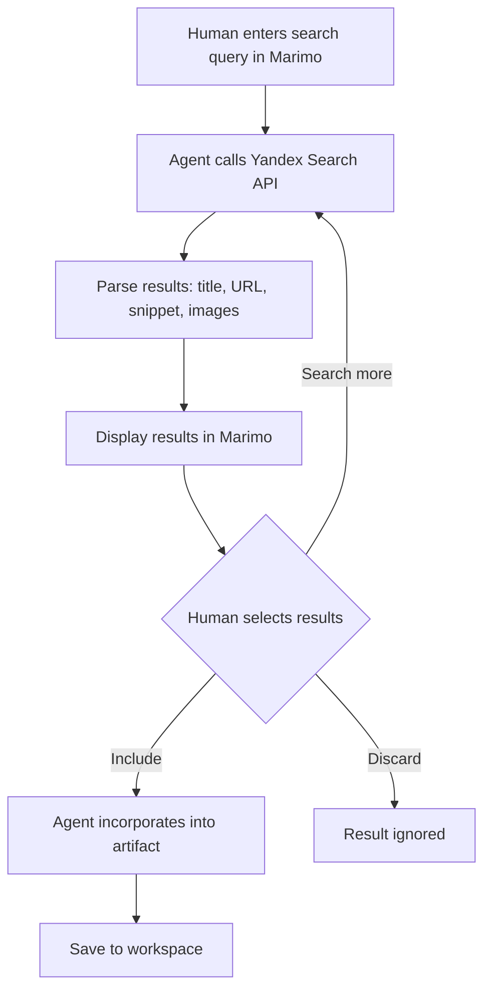

**Yandex Search Tools:**

| Tool | Description |
|------|-------------|
| `yandex_search` | Web search with query, max_results, time_range filters |
| `yandex_images` | Image search for visual assets |
| `yandex_fetch` | Fetch and extract page content from search results |

**Configuration:**

```yaml
# config.yaml
search:
  provider: "yandex"
  yandex:
    api_key: "${YANDEX_API_KEY}"
    endpoint: "https://search.yandex.net/search.json"
    image_endpoint: "https://search.yandex.net/images/search.json"
    default_max_results: 10
    time_range_options: ["day", "week", "month", "year"]
```

### Research Flow Per Phase

```
OUTLINE PHASE:
┌─────────────────────────────────────────────────────┐
│ Human: "Search for recent trends in AI presentations"│
│ Agent: Executes search → presents 10 results        │
│ Human: Reviews → selects 3 key themes              │
│ Agent: Generates outline based on selected themes   │
└─────────────────────────────────────────────────────┘

MANUSCRIPT PHASE:
┌─────────────────────────────────────────────────────┐
│ Human: "Find Q4 revenue data for Microsoft"         │
│ Agent: Executes search → presents results with URLs │
│ Human: Selects sources → Agent fetches content      │
│ Agent: Incorporates verified facts into manuscript  │
└─────────────────────────────────────────────────────┘

SLIDES PHASE:
┌─────────────────────────────────────────────────────┐
│ Human: "Find logo and hero image for this slide"    │
│ Agent: Image search → presents options              │
│ Human: Selects images → Agent downloads             │
│ Agent: Incorporates into HTML slide                 │
└─────────────────────────────────────────────────────┘
```

### Search Modes

```
Full Human-Directed (default)
┌──────────────────────────────────────────────┐
│ • Human enters every search query            │
│ • AI executes + presents results             │
│ • Human selects which results to use         │
│ • Best for: transparent, verified research   │
└──────────────────────────────────────────────┘

Attachments Only
┌──────────────────────────────────────────────┐
│ • AI uses only provided files                │
│ • No web search at all                       │
│ • Best for: internal reports, private data   │
└──────────────────────────────────────────────┘

Offline Mode
┌──────────────────────────────────────────────┐
│ • No network access at all                   │
│ • Uses only local files and AI knowledge     │
│ • Best for: air-gapped environments          │
└──────────────────────────────────────────────┘
```

---

## Execution Model: Marimo-Only (No Docker Sandbox)

The system does **not use Docker sandbox containers** for code execution. Instead, all execution happens within **Marimo Notebook's reactive environment**.

### Why No Sandbox?

```
                    ┌───────────────────────────────────────────┐
                    │  Sandbox Decision for HITL                │
                    └───────────────────────────────────────────┘

  Docker Sandbox (Previous)                    Marimo-Only (Current)
  ┌───────────────────────────────┐      ┌───────────────────────────────┐
  │ • LLM controls sandbox shell  │      │ • Human controls execution    │
  │ • Autonomous file operations  │      │ • AI generates, human reviews │
  │ • Heavy dependency (Docker)   │      │ • Lighter (Python + Marimo)   │
  │ • Slower startup              │      │ • Faster iteration            │
  │ • Arbitrary code execution    │      │ • Marimo handles execution    │
  │                               │      │                               │
  │ ❌ Designed for autonomous    │      │ ✅ Designed for HITL          │
  │    agent that needs freedom   │      │    where human is in control  │
  └───────────────────────────────┘      └───────────────────────────────┘
```

**Key insight:** The Docker sandbox was designed for an autonomous agent that needs a safe place to roam. In HITL, the human is in the driver's seat — the sandbox becomes unnecessary overhead.

### How Execution Works

```
Autonomous agent (old):                    HITL agent (new):
┌──────────────────────────────────┐      ┌──────────────────────────────────┐
│ "Let me run Python to generate   │      │ "I can generate a chart using    │
│  a chart"                        │      │  matplotlib. Want me to?"        │
│ → Sandbox executes               │      │ → Human: "Yes"                   │
│ → LLM incorporates result        │      │ → AI generates chart             │
│ → Human sees final output        │      │ → Human sees preview in Marimo   │
│                                  │      │ → Human: "Looks good, save it"   │
│ ❌ Black box execution           │      │ → AI saves to workspace          │
│ ❌ Human not involved            │      │                                  │
│                                  │      │ ✅ Transparent execution         │
│                                  │      │ ✅ Human involved at every step  │
└──────────────────────────────────┘      └──────────────────────────────────┘
```

### What Replaces Sandbox Capabilities

| Sandbox Capability | Marimo Replacement |
|-------------------|-------------------|
| File read/write | Marimo cells read/write files directly |
| Python execution | Marimo reactive cells execute Python |
| Chart generation | matplotlib/plotly in Marimo cells, rendered inline |
| HTML rendering | Marimo's HTML renderer shows slides inline |
| Command execution | Not needed — AI generates code, human runs it |
| Isolated environment | Marimo's controlled execution context |

### Removed Dependencies

The following are **no longer required**:

```
❌ Docker (no sandbox containers)
❌ deeppresenter-sandbox image
❌ deeppresenter-host image
❌ DesktopCommanderMCP
❌ Docker-in-Docker setup
❌ Container lifecycle management
```

### Simplified Setup

```bash
# Before (with Docker):
uv sync
playwright install --with-deps
npm install --prefix deeppresenter/html2pptx
modelscope download forceless/fasttext-language-id
docker pull forceless/deeppresenter-sandbox
docker tag forceless/deeppresenter-sandbox deeppresenter-sandbox
docker pull forceless/deeppresenter-host

# After (Marimo-only):
uv sync
playwright install --with-deps
npm install --prefix deeppresenter/html2pptx
modelscope download forceless/fasttext-language-id
pip install marimo
```

### Architecture Impact

```
BEFORE:                          AFTER:

  Agent → Sandbox (Docker)         Agent → Marimo
         │                               │
         ├─ read_file                  ├─ read_file (Python)
         ├─ write_file                 ├─ write_file (Python)
         ├─ execute_command            ├─ generate code (text)
         ├─ python code                ├─ human executes code
         └─ node code                  └─ human executes node
```

The agent no longer executes code — it **generates code and artifacts**, and the human executes them in Marimo's reactive environment.

---

## Data Flow

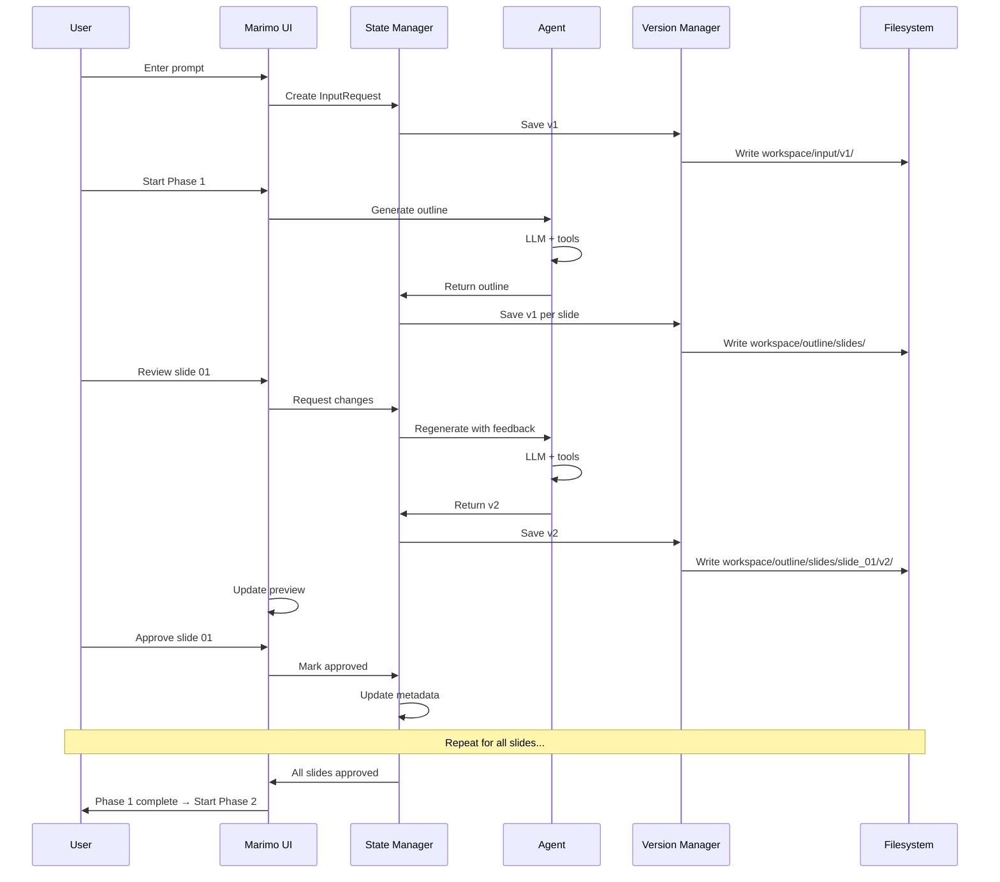

---

## Slide Management

Slides can be added, removed, or reordered at any time during the pipeline. Removed slides are never deleted — they are marked as `status: "removed"` and their artifacts are preserved.

### Adding Slides

```mermaid
flowchart TD
    A[Human clicks "Add Slide"] --> B{How to create?}
    B -->|AI-generated| C[Chat with agent to define slide]
    B -->|Manual| D[Enter title and content manually]
    B -->|Duplicate| E[Copy existing slide as template]
    B -->|Import| F[Import from file or another presentation]

    C --> G[Agent generates outline for new slide]
    D --> H[Human writes content]
    E --> I[Clone artifacts from source slide]
    F --> J[Parse and convert imported content]

    G --> K[Create new slide_NN folder]
    H --> K
    I --> K
    J --> K

    K --> L[Assign new unique ID]
    L --> M[Human sets order_number]
    M --> N[Rename affected slides' order_numbers]
    N --> O[Set status: active]
    O --> P[Save to workspace]
```

**Slide ID and Order:**
- Each slide has a **unique ID** (e.g., `slide_01`, `slide_02`) — never changes
- Each slide has an **order_number** — determines display/export order
- New slide gets a new ID, human sets its order_number
- All slides with order_number > new slide's position are renumbered

**Example:**
```
Before: slide_01(order=1), slide_02(order=2), slide_03(order=3), slide_04(order=4)
Add new slide at position 2:
After:  slide_01(order=1), slide_new(order=2), slide_02(order=3), slide_03(order=4), slide_04(order=5)
```

**Adding during different phases:**

| Phase | What's created | What carries forward |
|-------|---------------|---------------------|
| **Outline** | Outline + Manuscript + Slide artifacts (complete) | All phases generated for the new slide |
| **Manuscript** | Outline + Manuscript + Slide artifacts (complete) | All phases generated for the new slide |
| **Slides** | Outline + Manuscript + Slide artifacts (complete) | All phases generated for the new slide |
| **Export** | All artifacts + re-export | Full pipeline run for the new slide |

**Note:** Adding a slide always generates all phases (Outline + Manuscript + Slide) regardless of current phase. This ensures consistency.

### Removing Slides

```mermaid
flowchart TD
    A[Human clicks "Remove" on slide] --> B[Confirm removal?]
    B -->|Cancel| C[Slide stays active]
    B -->|Confirm| D[Mark status: removed]
    D --> E[Record removed_at timestamp]
    E --> F[Exclude from preview/export]
    F --> G[Keep all artifacts in place]

    note right of G
        Artifacts preserved:
        - outline/v1/, v2/, ...
        - manuscript/v1/, v2/, ...
        - slides/v1/, v2/, ...
        - chat/history.jsonl
        - metadata.json
    end note
```

**Removing during different phases:**

| Phase | Effect |
|-------|--------|
| **Any phase** | Slide excluded from current phase preview and final export |
| **Manuscript** | If removed here, Design phase skips this slide |
| **Slides** | If removed here, Export skips this slide |
| **Export** | If removed here, re-export without this slide |

### Restoring Slides

```mermaid
flowchart TD
    A[Human clicks "Restore" on removed slide] --> B{Which phase to restore to?}
    B -->|Current phase| C[Set status: active, regenerate from previous phase]
    B -->|All phases| D[Set status: active, regenerate all phases]
    B -->|Keep artifacts| E[Set status: active, use existing artifacts]

    C --> F[Run phase generation for this slide]
    D --> G[Run full pipeline for this slide]
    E --> H[Just flip status, no regeneration]

    F --> I[Update metadata]
    G --> I
    H --> I
```

### Reordering Slides

Slides can be reordered without changing their IDs:

```
Before:  slide_01, slide_02, slide_03(removed), slide_04, slide_05
After:   slide_01, slide_04, slide_02, slide_05  (slide_03 stays removed)

Export order: slide_01 → slide_04 → slide_02 → slide_05
(Folder names stay the same — only the display order changes)
```

Reorder is stored in metadata:

```json
{
  "slide_order": ["slide_01", "slide_04", "slide_02", "slide_05"],
  "removed_slides": ["slide_03"]
}
```

### Strict Phase Gates

The system uses **strict phase gates** — all slides must complete Phase N before any slide starts Phase N+1.

```
PHASE GATE RULES:

  ┌─────────────────────────────────────────────────────────────┐
  │  Phase N (e.g., Outline)                                   │
  │  ┌──────────┬──────────┬──────────┬──────────┐             │
  │  │ Slide 1  │ Slide 2  │ Slide 3  │ Slide 4  │             │
  │  │ ✅ Done  │ ✅ Done  │ ✅ Done  │ ✅ Done  │             │
  │  └──────────┴──────────┴──────────┴──────────┘             │
  │                          ↓                                 │
  │                  ALL APPROVED?                             │
  │                          ↓                                 │
  │  Phase N+1 (e.g., Manuscript)                             │
  │  ┌──────────┬──────────┬──────────┬──────────┐             │
  │  │ Slide 1  │ Slide 2  │ Slide 3  │ Slide 4  │             │
  │  │ ⏳ Doing │ ⏳ Doing │ ⏳ Doing │ ⏳ Doing │             │
  │  └──────────┴──────────┴──────────┴──────────┘             │
  └─────────────────────────────────────────────────────────────┘

  ❌ Slide 1 cannot start Manuscript while Slide 2 is still in Outline
  ✅ All slides move together through phases
  ✅ Simpler state management, easier to understand
```

**Why strict gates:**
- Simpler to implement and reason about
- Clear progress indicator (which phase are we in?)
- No complex cross-phase dependency tracking
- Human sees all slides at the same stage

### Editing Slides

During **Outline** and **Manuscript** phases, slides are fully editable:

**Outline editing:**
- Edit title and context directly in Marimo
- Agent regenerates based on chat feedback
- Changes propagate to Manuscript phase when approved

**Manuscript editing:**
- Edit markdown content directly in Marimo
- Agent regenerates based on chat feedback
- Changes propagate to Slides phase when approved

**Slide editing:**
- Edit HTML/CSS directly in Marimo
- Agent regenerates based on chat feedback
- Visual preview updates reactively

---

## Key Design Decisions

### 1. Per-Slide Subfolders

Each slide gets its own subfolder at every phase level:

```
outline/slides/slide_01/
manuscript/slides/slide_01/
slides/slide_01/
```

**Why:**
- Human can see all artifacts for a single slide in one place
- Versioning is natural — each version is a subfolder
- Parallel processing is possible (each slide is independent)
- Easy to navigate in a file explorer

### 2. Versioned Artifacts

Every regeneration creates a new version:

```
slide_01/
├── v1/  ← Original generation
├── v2/  ← After first revision request
├── v3/  ← After chat feedback
└── current.json  ← Symlink to latest approved version
```

**Why:**
- Human can compare versions
- No loss of work — previous versions always available
- Audit trail for quality
- Easy rollback

### 3. Partial Approval

Not all slides need to be approved simultaneously:

```
Phase: Manuscript
Status: partial (7/10 approved)

Slide 01: ✅ Approved (v1)
Slide 02: ✅ Approved (v2)
Slide 03: ⏳ Pending revision
Slide 04: ✅ Approved (v1)
...
```

**Why:**
- Human can approve good slides while iterating on bad ones
- No need to wait for all slides to be perfect
- Reduces cognitive load — focus on one slide at a time

### 4. Marimo as UI

**Why Marimo over alternatives:**

| Feature | Marimo | Jupyter | Streamlit | Gradio |
|---------|--------|---------|-----------|--------|
| Reactive | ✅ Auto-propagates | ❌ Manual | ✅ Auto | ✅ Auto |
| Git-friendly | ✅ .py files | ❌ JSON | ✅ .py | ✅ .py |
| Per-slide state | ✅ Natural | ⚠️ Possible | ⚠️ Possible | ⚠️ Possible |
| Chat integration | ✅ Built-in | ❌ Third-party | ❌ Third-party | ✅ Built-in |
| Deploy as app | ✅ Native | ❌ Complex | ✅ Native | ✅ Native |
| AI-native | ✅ Built-in | ❌ None | ❌ None | ⚠️ Basic |

### 5. Model Selection with Auto-Fallback

Each phase has its own model selector. The system supports automatic fallback when models fail.

```
MODEL FALLBACK CHAIN:

  ┌─────────────────────────────────────────────────────────────┐
  │  Phase: Outline                                             │
  │  Primary: Claude Sonnet 4.5 (OpenRouter)                   │
  │  ↓                                                          │
  │  Error count > 3 → Auto mode: try next available model     │
  │  ↓                                                          │
  │  Auto mode errors > 3 → Fallback to local LM Studio        │
  │  ↓                                                          │
  │  LM Studio default model                                    │
  └─────────────────────────────────────────────────────────────┘

Fallback triggers:
- 3 consecutive errors from OpenRouter → auto-select next model
- 3 consecutive errors in auto mode → switch to local LM Studio
- LM Studio errors → show error to user, manual intervention required

Configuration:

```yaml
# config.yaml
phases:
  outline:
    model: "anthropic/claude-sonnet-4.5"
    provider: "openrouter"
    fallback:
      auto_after_errors: 3
      local_model: "qwen3-coder-plus"
      local_provider: "lmstudio"
  manuscript:
    model: "openai/gpt-4o"
    provider: "openrouter"
    fallback:
      auto_after_errors: 3
      local_model: "qwen3-coder-plus"
      local_provider: "lmstudio"
  slides:
    model: "google/gemini-3-pro-preview"
    provider: "openrouter"
    fallback:
      auto_after_errors: 3
      local_model: "qwen3-coder-plus"
      local_provider: "lmstudio"
```

---

## API Surface

### Core Interfaces

```python
# State management
class SlideStatus:
    ACTIVE = "active"
    REMOVED = "removed"

class PhaseState:
    phase: Phase  # input, outline, manuscript, slides, export
    status: PhaseStatus  # pending, generating, reviewing, approved, partial
    current_version: int

class SlideState:
    slide_id: str
    status: SlideStatus  # active, removed
    created_at: datetime
    removed_at: datetime | None
    phases: dict[Phase, SlidePhaseState]

class SlidePhaseState:
    status: SlideStatus  # pending, generated, approved, revision_requested
    versions: list[Version]
    approved_version: int | None

# Slide management
class SlideManager:
    async def add_slide(
        self,
        mode: Literal["ai", "manual", "duplicate", "import"],
        source: dict | None = None,
        position: int | None = None,
    ) -> SlideState:
        """Add a new slide. Assigns next available slide_NN ID."""
        ...

    async def remove_slide(self, slide_id: str) -> None:
        """Mark slide as removed. Preserves all artifacts."""
        ...

    async def restore_slide(
        self,
        slide_id: str,
        mode: Literal["current_phase", "all_phases", "keep_artifacts"],
    ) -> None:
        """Restore a removed slide."""
        ...

    async def reorder_slides(self, new_order: list[str]) -> None:
        """Reorder slides. IDs stay the same, only display order changes."""
        ...

    async def get_active_slides(self) -> list[SlideState]:
        """Return only active slides in display order."""
        ...

    async def get_all_slides(self, include_removed: bool = False) -> list[SlideState]:
        """Return all slides or only active ones."""
        ...

# Version management
class VersionManager:
    async def save(self, slide_id: str, phase: Phase, artifact: Artifact, feedback: str) -> int
    async def load(self, slide_id: str, phase: Phase, version: int) -> Artifact
    async def approve(self, slide_id: str, phase: Phase, version: int)
    async def history(self, slide_id: str, phase: Phase) -> list[VersionInfo]

# Agent orchestration
class AgentOrchestrator:
    async def generate(self, phase: Phase, slide_ids: list[str], context: dict) -> list[Artifact]
    async def regenerate(self, slide_id: str, phase: Phase, feedback: str, model: str) -> Artifact
    async def chat(self, slide_id: str, phase: Phase, message: str, model: str) -> ChatResponse

# Search (Yandex)
class SearchResult(BaseModel):
    title: str
    url: str
    snippet: str
    source: str
    included: bool = False

class SearchManager:
    async def search(
        self,
        query: str,
        max_results: int = 10,
        time_range: Literal["day", "week", "month", "year"] | None = None,
    ) -> list[SearchResult]:
        """Execute Yandex web search. Human reviews results."""
        ...

    async def search_images(
        self,
        query: str,
        max_results: int = 10,
    ) -> list[dict]:
        """Execute Yandex image search. Human selects images."""
        ...

    async def fetch_url(self, url: str) -> str:
        """Fetch and extract content from URL."""
        ...

    async def mark_result(self, url: str, included: bool) -> None:
        """Human marks a search result as included or discarded."""
        ...

    async def get_search_history(self, slide_id: str) -> list[dict]:
        """Return all search queries and results for a slide."""
        ...
```

### Marimo Integration

```python
import marimo

app = marimo.App()

@app.cell
def global_controls():
    phase = marimo.ui.dropdown(["Input", "Outline", "Manuscript", "Slides", "Export"])
    model = marimo.ui.dropdown(["Claude Sonnet 4.5", "GPT-4o", "Gemini Pro"])
    return phase, model

@app.cell
def slide_cards(phase, state_manager):
    slides = state_manager.get_slides(phase.value)
    cards = [create_slide_card(slide, phase.value) for slide in slides]
    return cards

@app.cell
def create_slide_card(slide, phase):
    preview = load_artifact(slide.id, phase)
    approve_btn = marimo.ui.checkbox(label="Approve")
    chat = marimo.ui.chat()
    return preview, approve_btn, chat
```

### 6. Reactivity Model

The system implements **minimal reactivity** — changes only propagate when explicitly triggered by user action. However, there is one exception: **the manuscript is always kept current**.

```
                    ┌───────────────────────────────────────────┐
                    │  Reactivity Rules                         │
                    └───────────────────────────────────────────┘

  Minimal Reactivity (Default):
  ┌──────────────────────────────────────────────┐
  │ • User clicks "Approve" → state updates      │
  │ • User clicks "Regenerate" → agent runs      │
  │ • File changes → manual refresh needed       │
  │ • No auto-propagation of changes             │
  │ • Simple, predictable, easy to debug         │
  └──────────────────────────────────────────────┘

  Manuscript Exception (Always Current):
  ┌──────────────────────────────────────────────┐
  │ • Manuscript ALWAYS reflects actual content  │
  │ • When slide content changes → manuscript    │
  │   updates immediately                        │
  │ • When manuscript changes → slide updates    │
  │   immediately                                │
  │ • Bidirectional sync between slide and       │
  │   manuscript                                 │
  │ • Manuscript is the source of truth          │
  └──────────────────────────────────────────────┘

  Why Manuscript is Different:
  ┌──────────────────────────────────────────────┐
  │ • Manuscript is the bridge between Outline   │
  │   and Slides phases                          │
  │ • If slide 3 changes, the manuscript must    │
  │   reflect that change immediately            │
  │ • If manuscript is edited, the slide must    │
  │   update to match                            │
  │ • This ensures consistency across phases     │
  └──────────────────────────────────────────────┘
```

**Reactivity Examples:**

```
Slide 3 content changed (via chat or edit):
  → Manuscript slide 3 section updates immediately
  → If slides 4-5 are affected, they're marked "pending"
  → Slide 4-5 HTML will regenerate on next pass

Manuscript slide 3 edited directly:
  → Slide 3 content updates immediately
  → If outline needs updating, slide 3 marked "pending"
  → All other slides remain unchanged
```

---

## Next Steps

This document describes the technical architecture. To proceed:

1. **Refine this design** — Discuss specific phases, edge cases, or tradeoffs
2. **Create implementation plan** — Break into tasks for `/skills aif-plan`
3. **Prototype Marimo UI** — Build a proof-of-concept notebook
4. **Design state machine** — Implement the phase state machine in Python
5. **Integrate existing agents** — Adapt Planner, Research, Design agents for per-slide operation
